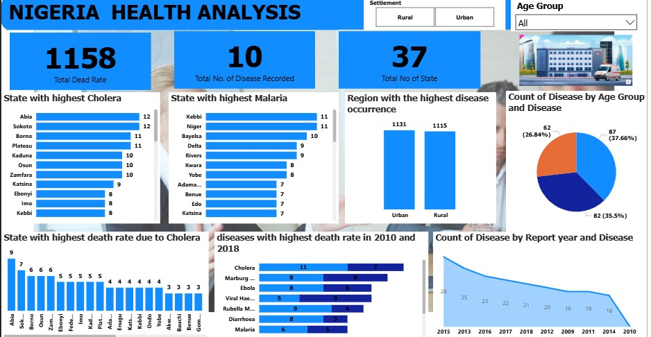

# Nigeria-Health-Analysis-Dashboard

## Project Overview

This project was developed as part of the Codeant Technology Hub – Talent Pool Mentorship Program and It focuses on data-driven analysis of disease occurrence and mortality across Nigeria using an interactive dashboard. The goal of the analysis is to identify patterns in disease distribution, highlight high-risk regions, and provide insights that can support better public health decision-making.
The dashboard analyzes 10 major diseases across 37 Nigerian states, examining factors such as mortality rates, disease prevalence, regional differences, age group impact, and yearly trends.

# Dashboard Preview

## Key Metrics

Total Death Rate	1158

Total Diseases Recorded	10

States Covered	37

These KPIs provide a high-level summary of the health burden captured in the dataset.

# Key Analysis Areas
## 1. Cholera Distribution by State
The analysis highlights the states with the highest cholera cases. The most affected states include:

Abia

Sokoto

Borno

Plateau

Kaduna

Osun

This pattern suggests that cholera outbreaks occur across multiple geographic regions rather than being limited to a single area.

## 2. Malaria Distribution by State

Malaria remains one of the most widespread diseases in Nigeria.

States with the highest malaria cases include:

Kebbi

Niger

Bayelsa

Delta

Rivers

This reflects malaria’s strong presence across both northern and southern regions of the country.

## 3. Regional Disease Occurrence

The dashboard compares disease prevalence between Urban and Rural areas.

#### Region	Cases
Urban	1131

Rural	1115

Disease occurrence is almost evenly distributed across both regions, indicating that public health interventions are needed in both urban and rural communities.

## 4. Disease Distribution by Age Group

#### Age Group	Cases	Percentage

Age Group 1	87	37.66%

Age Group 2	82	35.5%

Age Group 3	62	26.84%

The results suggest that younger and middle-aged populations experience higher disease incidence compared to older age groups.

## 5. Disease Mortality Comparison (2010 vs 2018)

The dashboard compares death rates for several diseases across two years to observe mortality changes.

#### Key observations include:

- Cholera recorded the highest mortality rate

- Viral hemorrhagic diseases showed increased mortality in later years

- Some diseases such as diarrhea showed a decline

This comparison helps highlight shifts in disease severity over time.

## 6. Disease Reporting Trend

The yearly reporting trend shows variations in disease reporting between 2010 and 2018.

#### Notable insights:

- Disease reporting peaked around 2015

- There is a gradual decline toward 2010

Trends may reflect improvements in disease control, reporting practices, or healthcare interventions.

# Key Insights

- Cholera and malaria remain major public health challenges in Nigeria.

- Disease occurrence is almost evenly distributed between urban and rural populations.

- Several states consistently report higher disease prevalence, indicating possible environmental or infrastructural factors.

- Younger populations appear to experience higher disease incidence rates.

Some diseases show changing mortality patterns over time, suggesting evolving health risks.

# Tools & Technologies

- Power BI – Data visualization and dashboard development

- Data Cleaning & Analysis

- Public Health Dataset

# Author

# Christopher Stanley

 #### Data Analyst with interest in Business and health analytics, business intelligence, and data visualization.

GitHub: https://github.com/christopherstanleyobinna-rgb

LinkedIn:https://www.linkedin.com/in/stanley-christopher-879023334/
